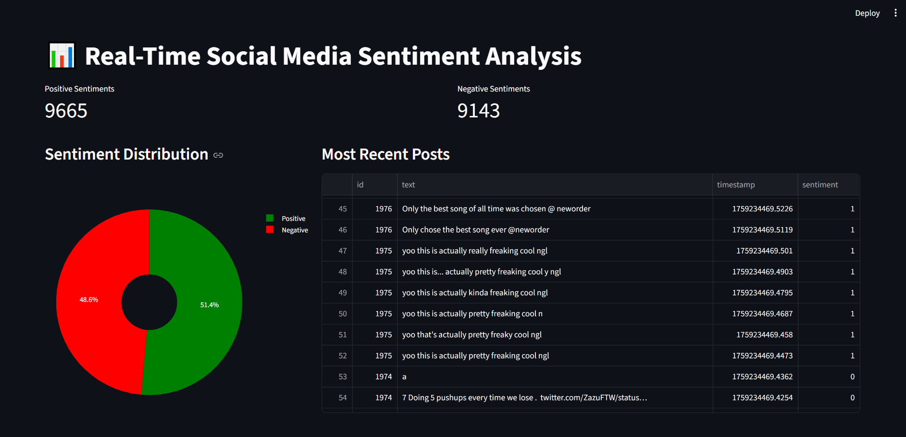

🚀 Real-Time Sentiment Analysis Pipeline: Project Launchpad
This project demonstrates a complete, end-to-end data pipeline that ingests a stream of text data, performs sentiment analysis in real-time using a pre-trained machine learning model, and displays the results on a live, auto-refreshing dashboard.

The entire 8-service application is containerized, allowing anyone to run it with a single command.

🛠️ How to Run This Application
This application is designed to be run with minimal setup.

Prerequisites
Docker & Docker Compose: You must have Docker Desktop installed.

Git: You must have Git installed to clone this repository.

Setup Instructions
Step 1: Clone the Repository
Open a terminal and clone this GitHub repository to your local machine:

Type code below: 
git clone https://github.com/HatifNeyaz/sentiment_analysis

Your final folder structure must look like this:

realtime-sentiment/
├── data/
│   └── twitter_training.csv
├── models/
│   └── sentiment_pipeline.joblib
├── api/
├── consumer/
├── dashboard/
├── producer/
└── docker-compose.yml
└── README.md

Step 3: Launch the Pipeline ⚙️
Now, you can build and run the entire 8-container application with a single command. This command also ensures all service images are built. Make sure you inside this directory.

docker-compose up --build
⏳ Be patient! The first startup can take several minutes, especially for the PySpark consumer service, which needs to download all its Spark dependencies.

💻 Accessing the Application
Step 4: View the Dashboard ✨
Once you see logs from all containers and messages like consumer | INFO - Writing batch... to MongoDB..., the pipeline is live and data is flowing.

Open your web browser and navigate to:

http://localhost:8501

You have to wait for 2-3 minutes, then press R to refresh.
You will see the live sentiment analysis dashboard, press R to refresh the data and get latest data information.

Accessing Other Services 🔗
Service	URL	Purpose	Credentials (if applicable)
Database Admin UI	http://localhost:8081	View raw data in MongoDB	root / password
Backend API (Raw Data)	http://localhost:5000/sentiments	Get raw JSON feed of recent data	N/A
Backend API (Counts)	http://localhost:5000/sentiment-counts	Get live aggregated sentiment counts	N/A

To Stop the Application 🛑
Press Ctrl+C in the terminal where the application is running, and then run:

docker-compose down

The dashboard looks something like this:

